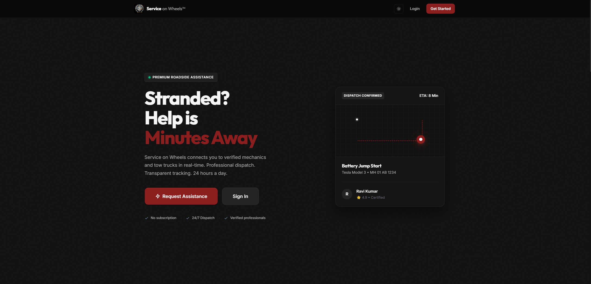
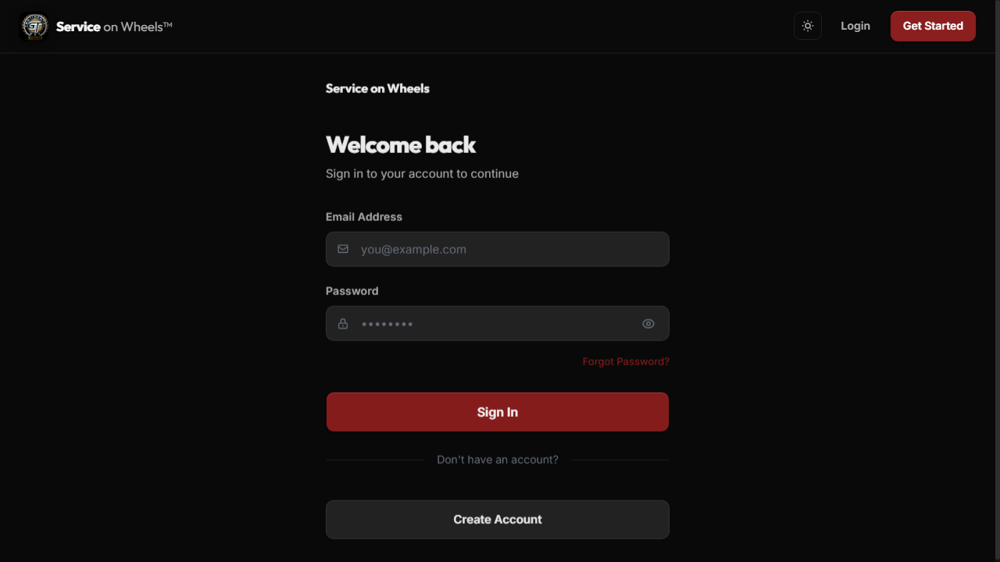
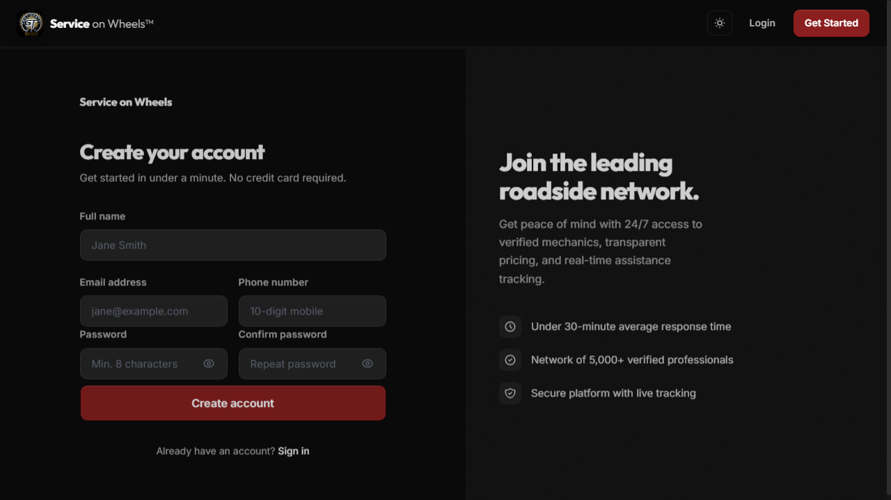
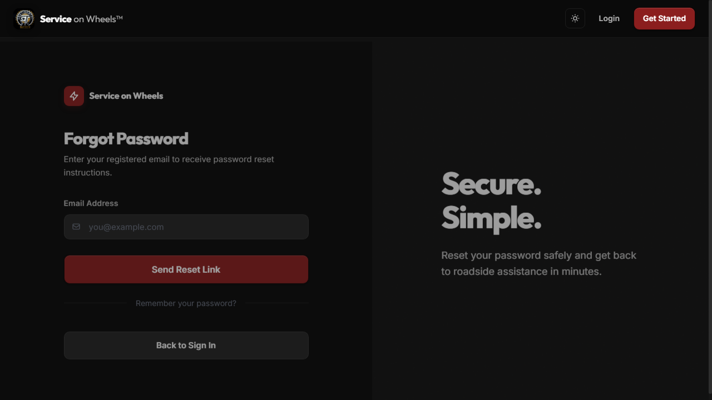
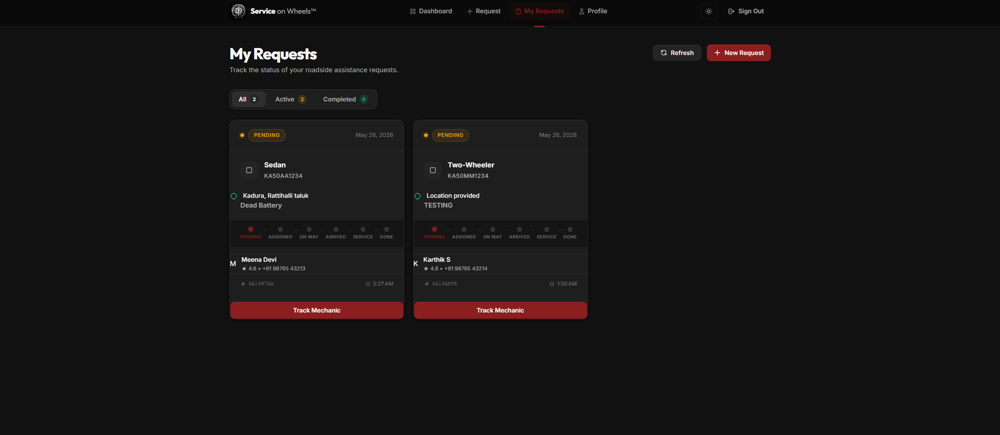
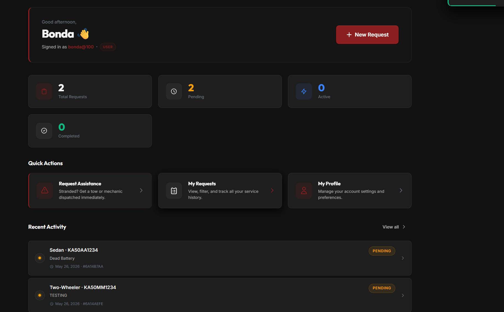

# Service on Wheels

A full-stack roadside assistance platform that allows users to submit GPS-located
service requests, track them through their lifecycle, and manage their profiles
through a secure web application.

**Live Demo:** [Add Railway/Render link here once deployed]

## Tech Stack

| Layer      | Technology                                         |
|------------|----------------------------------------------------|
| Frontend   | Angular 17, TypeScript, HTML5, CSS3, Leaflet Maps  |
| Backend    | Java 21, Spring Boot 3, Spring Security, Maven     |
| Auth       | JWT (JSON Web Tokens), BCrypt password encryption  |
| Database   | MongoDB                                            |
| Maps       | Leaflet.js + OpenStreetMap + Reverse Geocoding     |

## Features

- User registration and secure login with JWT authentication
- BCrypt password hashing for all stored credentials
- Forgot password workflow with email-based reset link
- Interactive map for GPS location selection (Leaflet + OpenStreetMap)
- Automatic GPS detection with coordinate-based request submission
- Service request creation: vehicle type, issue selection, notes, location
- Request history and status lifecycle tracking
- Personalized dashboard with request statistics
- Route protection on all authenticated Angular routes

## Screenshots

## 📸 Screenshots

###  Landing Page


###  Login Page


###  Register Page


###  Forgot Password


### Create Service Request


###  My Requests


### User Profile


###  User Dashboard



## Architecture

```
Angular Frontend (localhost:4200)
    |
    |  HTTP Requests + JWT Bearer Token
    v
Spring Boot REST API (localhost:8081)
    |-- Spring Security Filter Chain
    |-- JWT Validation
    |-- Service Layer (business logic)
    |-- Repository Layer
    v
MongoDB (Atlas or local)
```

## Getting Started

### Prerequisites
- Java 21+
- Node.js 18+ and npm
- Angular CLI (`npm install -g @angular/cli`)
- MongoDB (local or Atlas connection string)

### 1. Clone the repository
```bash
git clone https://github.com/PhoenixX18/ServiceOnWheels1.git
cd ServiceOnWheels1
```

### 2. Backend
```bash
cd backend/service-on-wheels-backend
# Create application.properties or set environment variables:
# MONGODB_URI, JWT_SECRET, MAIL_USERNAME, MAIL_PASSWORD, FRONTEND_RESET_URL
mvn spring-boot:run
# API runs at http://localhost:8081
```

### 3. Frontend
```bash
cd customer-app
npm install
ng serve
# App runs at http://localhost:4200
```

### Environment Variables
```
MONGODB_URI=mongodb+srv://<user>:<pass>@cluster.mongodb.net/servicedb
JWT_SECRET=<min-32-character-random-string>
FRONTEND_RESET_URL=http://localhost:4200/reset-password
MAIL_USERNAME=your@email.com
MAIL_PASSWORD=your-app-password
```
Never commit .env files or real secrets. Use environment variables in your deployment platform.

## Roadmap

- [ ] Unit and integration tests (JUnit 5 + Mockito)
- [ ] Docker + docker-compose for one-command setup
- [ ] Mechanic portal with role-based access control
- [ ] Real-time status updates (WebSocket)
- [ ] Refresh token support
- [ ] CI/CD pipeline (GitHub Actions)
- [ ] Cloud deployment (Railway or Render)

## Author

T Mukesh — [github.com/PhoenixX18](https://github.com/PhoenixX18)
